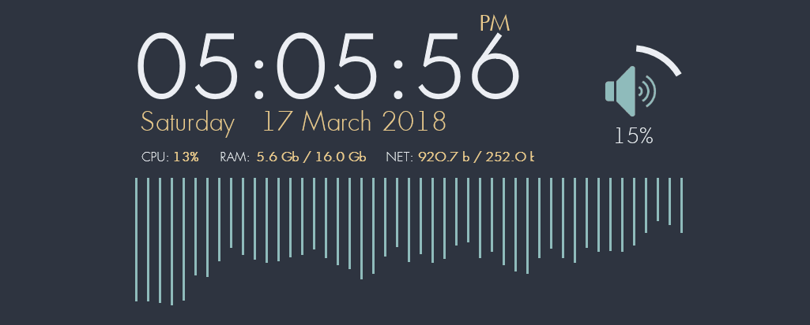
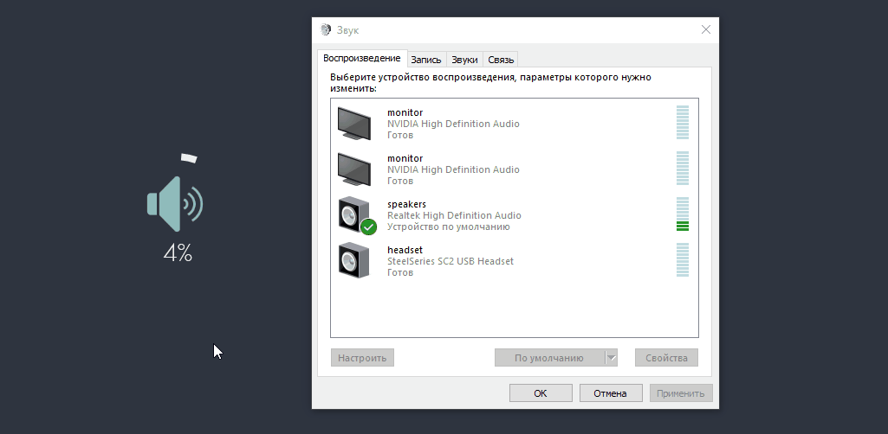
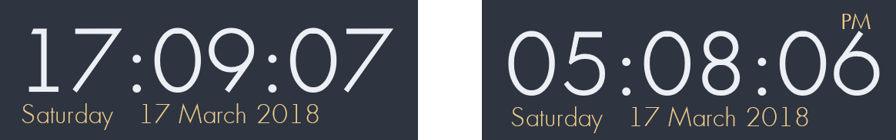
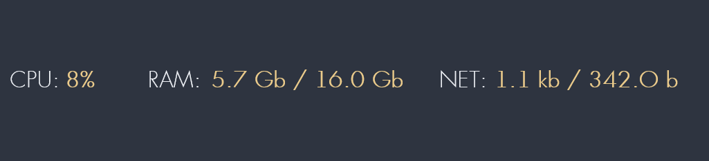
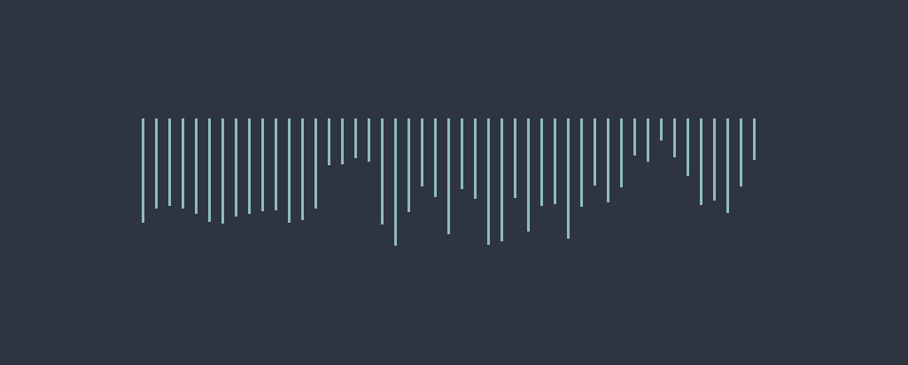

# Nord owl theme (Rainmeter)

An arctic, north-bluish clean and elegant minimal  skins on your desktop.  
Based on the <a href="https://github.com/arcticicestudio/nord">Nord</a> color palette. 

## Preview

## Getting started
**Installation**
* Download and install [Rainmeter (4.0+)](https://www.rainmeter.net/)
* Download and install [last release theme](https://github.com/Findoss/Rainmeter-Machu-Picchu/releases)
or build from [source](https://github.com/Findoss/Rainmeter-Machu-Picchu/tree/master/Machu-Picchu)  

**Important!** For the correct work of the AudioControl icons, assign appropriate names (`speakers`/`headset`/`monitor`) to the playback devices
[Image hint](media/cfg_playback_devices.png)

**Languages**
  1. Русский
  2. English

## Usage Guide
### Audio control
  
  * Switch audio devices - click the middle mouse button
  * Volume - scroll up and down
  * Mute - click the left mouse button

### Trash
  
  * Open folder trash - click the left mouse button
  * Empty trash - click the right mouse button
  * Start CCleaner - click the middle mouse button  
  **Important!** Path CCleaner in `@Resources/Variables.inc`

### Clock
  
> 12h / 24h

### System info
  

### Power bar
  

### Audio visualizer
  

### Settings [Rainmeter skin configurator (v2.0.2)](https://github.com/Findoss/Rainmeter-skin-configurator)
  * Open settings - click the left mouse button

## Advanced settings
Core settings in [Variables.inc](https://github.com/Findoss/Rainmeter-Machu-Picchu/blob/master/Machu-Picchu/%40Resources/Variables.inc)
`Rainmeter/Skins/Machu-Picchu/@Resources/Variables.inc`

## Contributing
Please read [CONTRIBUTING.md](https://github.com/Findoss/Nord-owl/CONTRIBUTING.md) for details on our code of conduct, and the process for submitting pull requests to us.

### Localization
  1. Copy file to `Machu-Picchu/@Resources/Language` (file extension only `.inc`)
  2. Translate to your language, **please share a translation with me**.
  3. Change your file name in core settings `Language = new_file_name`
  4. Save file and refresh all skins

## Authors
  * Nikita Stroganov - Initial work
  * [Treor](https://github.com/Treor) - translate Egnlish language

## License
[MIT](https://github.com/Findoss/Nord-owl/LICENSE). Copyright (c) Findoss.
